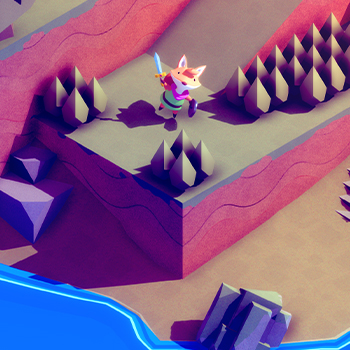

# Overview
[Tunic](https://tunicgame.com/) is an award-winning, thought-provoking action / puzzler game!  
A big part of the fun is unraveling the mystery of the game's mechanics, lore, goals and secret language.

/// caption
Tunic the game (not affiliated with Tunic Language Tool)
///

**Tunic Language Tool (TLT)** is a fan-made web application that I created to help "solve" the in-game language.  
It is **not** affiliated with Isometricorp Games LTD, Finji or any other official entity.

**TLT** does *not* directly translate the language for you.
It gives you a more convenient tool than pencil and paper to solve the language yourself!

The app's main [features](Features.md) are:

- A "rune editor" for entering your translation guesses for symbols of the game language
- A document editor supporting the game language plus regular English
- In-line translations that update immediately when you edit your guesses
- The ability so save your work to a downloadable file that you can re-open

You can [use it online](TryIt.md) for free with no ads, login or other annoyances!